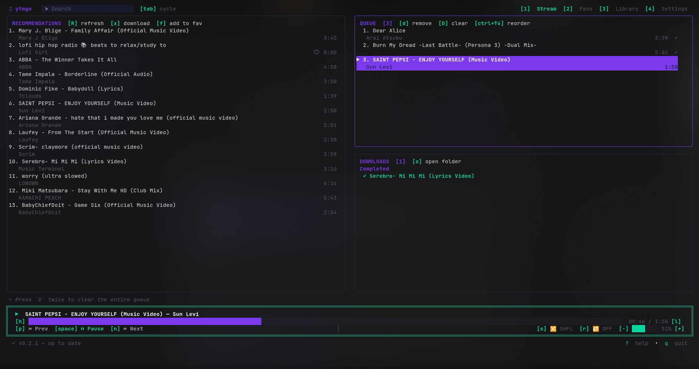

# ytmgo

A terminal-based YouTube Music client written in Go. Search YouTube, download audio, manage a play queue, and play music — all from the keyboard, inside your terminal.


---

## Install

One line does everything — grabs the static binary for your OS/arch, installs it, and auto-installs `mpv`/`yt-dlp`/`ffmpeg` if they're missing (using `sudo` for system package managers):

```bash
curl -fsSL https://raw.githubusercontent.com/anas1412/ytmgo/main/install.sh | bash
```

> Override the version: `YTMGO_VERSION=v0.2.0 curl ... | bash`
> Override the install dir: `YTMGO_INSTALL_DIR=/opt/bin curl ... | bash`

Or build from source (after installing `mpv`/`yt-dlp`/`ffmpeg` yourself):

```bash
go build -o ytmgo .
./ytmgo
```

---

## Features

- **YouTube Search** — Search YouTube directly from the terminal via `yt-dlp`
- **Audio Download** — Download tracks as MP3s with real-time progress
- **Play Queue** — Full queue management: reorder, shuffle, repeat (one / all)
- **Audio Playback** — Plays through `mpv` with seek, volume, and progress tracking
- **Keyboard-driven TUI** — Tab-focused layout with vim navigation, no mouse needed
- **Concurrency-safe** — Mutex-guarded queue, single-playback lock, serial download pipeline

---

## Demo



---

## Prerequisites

- **Go** 1.22+
- **mpv** — audio playback backend
- **yt-dlp** — YouTube search and audio downloading
- **Brave** / **Firefox** / **Chrome** *(optional)* — for cookie extraction to access age-restricted content; configurable in Settings

### Install system dependencies

```bash
# Debian / Ubuntu
sudo apt install mpv yt-dlp

# macOS
brew install mpv yt-dlp

# Arch Linux
sudo pacman -S mpv yt-dlp
```

---

## Build & Run

```bash
# Clone or navigate to the project
cd ytmgo

# Build
go build -o ytmgo .

# Run
./ytmgo
```

Or use the pre-built binary included in the repository.

---

## Usage

| Step | Action |
|------|--------|
| 1 | Press `Tab` to focus the search input |
| 2 | Type a query and press `Enter` |
| 3 | Browse results in the left panel (`↑↓` / `jk`) |
| 4 | Press `Enter` on a result to add to queue + start download |
| 5 | `Tab` to the queue panel, select a track, press `Enter` to play |
| 6 | Control playback with keys (see below) |

Tab cycles focus through: search input → result list → queue panel → settings — and the focused panel's border glows violet.

### Keybindings

| Key | Action |
|-----|--------|
| `Tab` | Cycle focus: search → results → queue → search |
| `↑↓` / `jk` | Navigate lists |
| `Enter` | Search: add to queue / Queue: play track |
| `Space` | Play / Pause |
| `n` / `→` | Next track |
| `p` / `←` | Previous track |
| `h` / `Ctrl+B` | Seek backward 5s |
| `l` / `Ctrl+F` | Seek forward 5s |
| `+` / `=` | Volume up |
| `-` / `_` | Volume down |
| `d` / `Delete` | Remove from queue |
| `D` | Clear entire queue |
| `s` | Toggle shuffle |
| `r` | Cycle repeat: OFF → ONE → ALL |
| `x` | Download selected track immediately |
| `R` | Refresh recommendations |
| `1` / `2` / `3` | Switch page: Stream / Library / Settings |
| `Ctrl+↑` / `Ctrl+↓` | Move item up/down in queue |
| `?` | Toggle help overlay |
| `q` / `Ctrl+C` | Quit |

---

## Project Structure

```
ytmgo/
├── main.go                      # Entry point, Bubble Tea program setup
├── internal/
│   ├── tui/                     # Terminal UI (Bubble Tea)
│   │   ├── model.go             # Application model and commands
│   │   ├── update.go            # Message handling and state updates
│   │   ├── view.go              # Rendering / layout (7 sections)
│   │   ├── styles.go            # Color palette and styles
│   │   └── keys.go              # Key bindings
│   ├── player/                  # mpv audio playback control
│   │   └── player.go            # Subprocess lifecycle, IPC polling
│   ├── queue/                   # Thread-safe play queue
│   │   └── queue.go             # Queue with shuffle, repeat, reorder
│   ├── search/                  # YouTube search via yt-dlp
│   │   └── search.go            # Search + result parsing
│   ├── downloader/              # Audio download via yt-dlp
│   │   └── downloader.go        # Serial download with progress
│   ├── ytdlp/                   # Shared yt-dlp argument helpers
│   │   └── args.go              # CookiesArg, UserAgentArg builders
│   └── settings/                # User config persistence
│       └── settings.go          # Settings model (7 fields)
├── downloads/                   # Downloaded MP3 files
├── go.mod / go.sum              # Go module dependencies
└── plan.md                      # Architecture design notes
```

### Internal dependencies

```
main
  └── internal/tui
        ├── internal/player      (mpv playback)
        ├── internal/queue       (track queue)
        ├── internal/search      (yt-dlp search + cookie/UA)
        ├── internal/downloader  (yt-dlp download + cookie/UA)
        ├── internal/ytdlp       (shared arg builders)
        └── internal/settings    (persistent config)
```

---

## Architecture Highlights

- **Single Playback Lock** — Only one `mpv` process runs at a time; old process is killed before starting new playback
- **Serial Download Pipeline** — One `yt-dlp` download at a time with a job queue behind it
- **Concurrency-safe Queue** — Mutex-guarded queue with shuffle, repeat-one, and repeat-all modes
- **mpv IPC Polling** — Real-time progress updates via Unix socket every 500ms
- **State Machine** — Player cycles through `Stopped → Playing → Paused → Playing → Stopped`
- **7-Section Layout** — Header (logo + search + page tabs), two side-by-side panels, download bar, double-border player bar, status line, help bar
- **Tab-cycle Focus** — Search input, result list, queue panel each get violet border glow when active
- **Shared yt-dlp Args** — `internal/ytdlp/args.go` provides `CookiesArg` and `UserAgentArg` helpers for consistent yt-dlp argument building across search and downloader
- **Configurable Settings** — Persistent settings (7 items): stream mode, auto-download, default volume, search limit, download directory, cookie browser, user-agent; editable in-app via page 3

---

## Built With

- [Bubble Tea](https://github.com/charmbracelet/bubbletea) — TUI framework
- [Bubbles](https://github.com/charmbracelet/bubbles) — TUI components
- [Lipgloss](https://github.com/charmbracelet/lipgloss) — Terminal styling
- [mpv](https://mpv.io/) — Media player backend
- [yt-dlp](https://github.com/yt-dlp/yt-dlp) — YouTube downloader

---

## License

MIT
