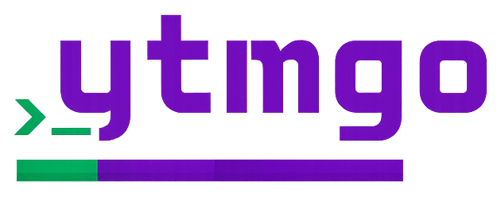

<p align="center">
  
</p>

# ytmgo — YT Music from Terminal

A terminal-based YouTube Music client written in Go. Search music, download audio, manage a play queue, bookmark favorites, and play music — all from the keyboard, inside your terminal.


---

## Install

One line does everything — grabs the static binary for your OS/arch, installs it, and auto-installs `mpv` if it's missing (using `sudo` for system package managers):

```bash
curl -fsSL https://anas1412.github.io/ytmgo/install.sh | bash
```

> Override the install dir: `YTMGO_INSTALL_DIR=/opt/bin curl ... | bash`

Or build from source (after installing `mpv` yourself):

```bash
go build -o ytmgo .
./ytmgo
```

---

## Uninstall

Remove ytmgo and all its data in one command:

```bash
curl -fsSL https://anas1412.github.io/ytmgo/install.sh | bash -s -- --yes
```

Wait — that's the install script. For uninstall:

```bash
curl -fsSL https://anas1412.github.io/ytmgo/uninstall.sh | bash
```

This will prompt you with three confirmations:

1. **Remove binary** — deletes `~/.local/bin/ytmgo` (or `/usr/local/bin/ytmgo`)
2. **Remove user data** — deletes `~/.config/ytmgo/` (settings, favorites, play history, queue)
3. **Remove downloads** — deletes `~/.local/share/ytmgo/downloads/` (all your downloaded files)

### Flags

| Flag | Behavior |
|------|----------|
| `-y` / `--yes` | Skip all prompts, remove **everything** |
| `--keep-downloads` | Keep your downloaded audio files |
| `--keep-user-data` | Keep your config database (settings, favorites, history) |

```bash
# Silent full removal
curl -fsSL https://anas1412.github.io/ytmgo/uninstall.sh | bash -s -- -y

# Remove binary + config, keep your music files
curl -fsSL https://anas1412.github.io/ytmgo/uninstall.sh | bash -s -- -y --keep-downloads

# Remove binary + files, keep your favorites and settings
curl -fsSL https://anas1412.github.io/ytmgo/uninstall.sh | bash -s -- -y --keep-user-data
```

System dependencies (mpv, yt-dlp, ffmpeg) are **not** touched — they may be used by other applications.

---

## Features

- **Search from the terminal** — No browser, no tabs. Search, pick, and queue without leaving your terminal.
- **Download in one key** — Press `x` on any track and it downloads. Queue-friendly, one at a time, with progress feedback.
- **Favorites page** — `f` to bookmark. Dedicated page to browse them all. Heart shows on every favorited track.
- **Full mouse support** — Click tabs, click panels, click the progress bar to seek. Most terminal apps can't do this.
- **Discord Rich Presence** — Show what you're listening to — track, artist, play status — live on your Discord profile.
- **Static binary, no bloat** — Pure Go, no Electron, no browser engine. Starts instantly, sips RAM, gets out of your way.

---

## Demo


---

## Prerequisites

- **Go** 1.22+
- **mpv** — audio playback backend
- **yt-dlp** — YouTube / YouTube Music streaming URL resolution and downloads
- **ffmpeg** — audio extraction for downloads (yt-dlp dependency)

### Install system dependencies

These are required for playback and downloads:

```bash
# Debian / Ubuntu
sudo apt install mpv yt-dlp ffmpeg

# macOS
brew install mpv yt-dlp ffmpeg

# Arch Linux
sudo pacman -S mpv yt-dlp ffmpeg
```

> yt-dlp is the core download engine — it searches YouTube Music for the track and streams/downloads the audio. ffmpeg is used by yt-dlp for audio extraction.

---

## Build & Run

```bash
# Clone or navigate to the project
cd ytmgo

# Build
go build -o ytmgo .

# Run
./ytmgo
```

Or use the pre-built binary included in the repository.

---

## Usage

| Step | Action |
|------|--------|
| 1 | Press `Tab` to focus the search input |
| 2 | Type a query and press `Enter` |
| 3 | Browse results in the left panel (`↑↓` / `jk`) |
| 4 | Press `Enter` on a result to add to queue + start download |
| 5 | `Tab` to the queue panel, select a track, press `Enter` to play |
| 6 | Control playback with keys (see below) |

Tab cycles focus through: search input → result list → queue panel → settings — and the focused panel's border glows violet.

**Mouse support** — Click header tabs to switch pages, click list items to select, double-click to activate, click the progress bar to seek, and click the controls row to play/pause, adjust volume, or toggle shuffle/repeat.

### Keybindings

| Key | Action |
|-----|--------|
| `Tab` | Cycle focus: search → results → queue → search |
| `↑↓` / `jk` | Navigate lists |
| `Enter` | Search: add to queue / Queue: play track |
| `Space` | Play / Pause |
| `n` / `→` | Next track |
| `p` / `←` | Previous track |
| `h` / `Ctrl+B` | Seek backward 5s |
| `l` / `Ctrl+F` | Seek forward 5s |
| `+` / `=` | Volume up |
| `-` / `_` | Volume down |
| `d` / `Delete` | Remove from queue |
| `D` | Clear entire queue |
| `C` | Clear play history |
| `f` | Toggle favorite on selected track |
| `s` | Toggle shuffle |
| `r` | Cycle repeat: OFF → ONE → ALL |
| `x` | Download selected track immediately |
| `R` | Refresh recommendations |
| `U` | Check for updates / confirm install |
| `1` / `2` / `3` / `4` | Switch page: Stream / Favorites / Library / Settings |
| `Ctrl+↑` / `Ctrl+↓` | Move item up/down in queue |
| `o` | Open download directory |
| `?` | Show keyboard shortcuts |
| `esc` | Cancel / back |
| `q` / `Ctrl+C` | Quit |

---

## Built With

- [Bubble Tea](https://github.com/charmbracelet/bubbletea) — TUI framework
- [Bubbles](https://github.com/charmbracelet/bubbles) — TUI components
- [Lipgloss](https://github.com/charmbracelet/lipgloss) — Terminal styling
- [mpv](https://mpv.io/) — Media player backend
- [yt-dlp](https://github.com/yt-dlp/yt-dlp) — YouTube Music streaming and downloads
- [ffmpeg](https://ffmpeg.org/) — Audio extraction for downloads
- [modernc.org/sqlite](https://modernc.org/sqlite) — Embedded SQLite (no CGO)

---

## License

MIT
