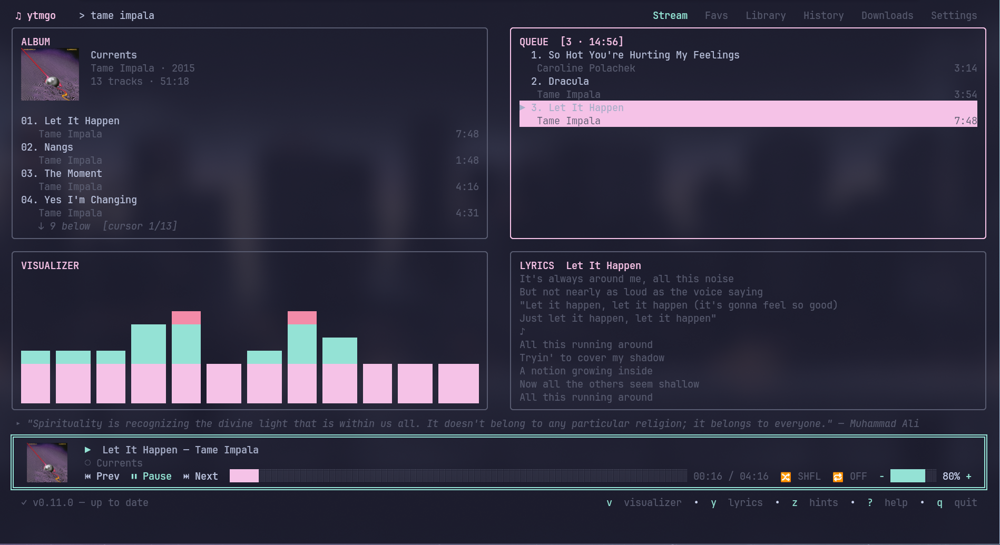
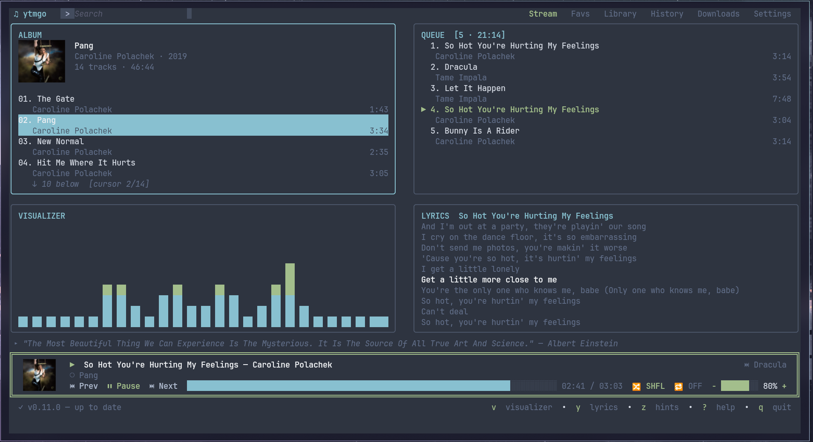

<p align="center">
  
</p>

# ytmgo — YT Music from Terminal

A terminal-based YouTube Music client written in Go. Search music, download audio, manage a play queue, bookmark favorites, and play music — all from the keyboard, inside your terminal.


---

Full documentation: **https://anas1412.github.io/ytmgo/**

## Install

### One-liner (Linux / macOS)

```bash
curl -fsSL https://raw.githubusercontent.com/anas1412/ytmgo/main/install.sh | bash
```

It detects your system automatically:
- **Arch Linux** — installs `ytmgo-bin` via `paru` or `yay`, or updates whichever of the two you already have
- **Other Linux / macOS** — downloads the static binary and installs deps

Either way you get the same prebuilt binary — nothing is compiled unless
you ask for it.

> Override the install dir: `YTMGO_INSTALL_DIR=/opt/bin curl ... | bash`

### Rolling build

Every push to `main` publishes a prerelease on the `latest` tag — the
newest code, not a release:

```bash
YTMGO_VERSION=latest curl -fsSL https://raw.githubusercontent.com/anas1412/ytmgo/main/install.sh | bash
```

It reports its own version as something like `v1.2.2-8-g3c10e7b`: the
last release, how far past it you are, and the commit. Normal installs
never see it — they follow the newest real release. Run the installer
again without `YTMGO_VERSION` to go back.

### AUR (Arch Linux)

The one-liner above handles this, but you can also install directly:

```bash
yay -S ytmgo      # builds from source
yay -S ytmgo-bin  # the released binary, no Go toolchain needed
```

`ytmgo` compiles from source and needs the Go toolchain (226 MB installed
if you don't already have it). `ytmgo-bin` installs the same static binary
the release publishes. Pick either — they conflict, so only one at a time.

Already on `ytmgo`? Updates keep you there; nothing switches a package
you chose. To move to the prebuilt one:

```bash
yay -R ytmgo && yay -S ytmgo-bin
```

### Build from source

```bash
go build -o ytmgo .
./ytmgo
```

---

## Uninstall

```bash
curl -fsSL https://anas1412.github.io/ytmgo/uninstall.sh | bash
```

Prompts you with three confirmations:

1. **Remove binary** — deletes `~/.local/bin/ytmgo` (or `/usr/local/bin/ytmgo`)
2. **Remove user data** — deletes the database in `~/.local/share/ytmgo/` (settings, favorites, play history, queue)
3. **Remove downloads** — deletes `~/.local/share/ytmgo/downloads/` (all your downloaded files)

### Flags

| Flag | Behavior |
|------|----------|
| `-y` / `--yes` | Skip all prompts, remove **everything** |
| `--keep-downloads` | Keep your downloaded audio files |
| `--keep-user-data` | Keep your config database (settings, favorites, history) |

```bash
# Silent full removal
curl -fsSL https://anas1412.github.io/ytmgo/uninstall.sh | bash -s -- -y

# Remove binary + config, keep your music files
curl -fsSL https://anas1412.github.io/ytmgo/uninstall.sh | bash -s -- -y --keep-downloads

# Remove binary + files, keep your favorites and settings
curl -fsSL https://anas1412.github.io/ytmgo/uninstall.sh | bash -s -- -y --keep-user-data
```

The yt-dlp installed alongside ytmgo is offered for removal. Other system dependencies (mpv, ffmpeg, cava) are **not** touched — they may be used by other applications.

---

## Features

- **Native YouTube Music search** — Talks to YT Music's own API directly (no key, no login, no third-party proxy). Results carry exact video IDs, so playback starts on the right recording every time.
- **Playlist import** — Paste a YouTube or Spotify playlist link into the search box and its tracks fill the results, ready to queue with `e`. Spotify has no playable audio, so its tracks are matched to YouTube Music on name and length — close enough is the same recording, an hour long is somebody's loop of it.
- **Album preview** — Reach any release from its artist's page and open its tracklist, ready to queue or download in one key. The album's cover takes over the now-playing panel while you browse; nothing is queued until you ask.
- **Artist pages** — Press `A` on any song to open whoever made it: their hundred most-played tracks, and `A` for their whole discography. Every release opens into its tracklist, so one song becomes a catalogue.
- **Synced lyrics** — Press `y` to swap the spectrum for lyrics, with the current line highlighted as the song plays (via LRCLIB, plain-text fallback from YT Music). Cached locally, so replays are instant.
- **Autoplay radio** — When the queue runs dry, ytmgo queues what YouTube Music itself would play next, seeded from your listening history.
- **Download in one key** — Press `x` on any track and it downloads. Queue-friendly, one at a time, with progress feedback.
- **Favorites, history, library** — `f` to bookmark, a listening-history page, and a filterable page for everything on disk.
- **Full mouse support** — Click tabs, click panels, click the progress bar to seek. Most terminal apps can't do this.
- **Media keys** — Play, pause, and skip with your keyboard's media keys, or from your desktop's media widget (Linux).
- **Eleven themes** — `terminal` (the default) borrows your terminal's own ANSI colours, so ytmgo matches
  whatever scheme you already run. `ytmgo` is the app's own palette, following your terminal's light or
  dark background. Then nine full schemes: gruvbox, nord, dracula, catppuccin, tokyo-night, rose-pine,
  everforest, solarized-light and latte. Set it in Settings; terminal and ytmgo leave your background
  (and any transparency) alone.
- **Now playing, everywhere** — Album art and the track's album sit in the player bar itself, on every page; `v` opens a live spectrum under your results. Art renders at full resolution on kitty, Ghostty and WezTerm, as coloured half-blocks elsewhere.
- **Discord Rich Presence** — Show what you're listening to — track, artist, play status — live on your Discord profile.
- **Last.fm scrobbling** — Connect once in Settings — ytmgo hands you a Last.fm link, you click Allow, and that's it; no password is ever typed into the app. Tracks scrobble once heard halfway or for four minutes, with the clean artist and title YouTube Music provides.
- **Static binary, no bloat** — Pure Go, no Electron, no browser engine. Starts instantly, sips RAM, gets out of your way.

---

## Demo


Album preview, live spectrum, and synced lyrics — in the default palette above,
or one of the nine built-in themes:

<p align="center">
  
  
</p>

---

## Supported systems

**Linux (any distribution) and macOS**, on x86_64 and arm64. Windows is
not supported.

The binary is built with cgo off, so it is statically linked and depends
on no system C library — the same build runs on glibc and on musl,
Alpine included. Playback goes through mpv, which picks its own audio
output, so PipeWire, PulseAudio, ALSA, JACK and sndio all work without
configuration.

Two features are Linux-only: **media keys** (MPRIS is D-Bus, so on macOS
they do nothing) and the **spectrum**, which needs cava to find a monitor
of your output — automatic on PipeWire and PulseAudio, a hand-configured
loopback on bare ALSA.

## Prerequisites

- **Go** 1.22+ (only to build from source)
- **mpv** — audio playback
- **yt-dlp** — downloads, and the stream resolution mpv performs when playing.
  Installed by the one-liner from [yt-dlp's own releases](https://github.com/yt-dlp/yt-dlp/releases)
  rather than your package manager, because distro builds freeze and a stale
  yt-dlp cannot open a single track. That copy self-updates with `yt-dlp -U`.
  If you already have a packaged yt-dlp, leave it — ytmgo runs its own by
  absolute path and points mpv's stream hook at the same one, so your `PATH`
  order does not decide which is used.
- **ffmpeg** — audio extraction and cover-art embedding (includes `ffprobe`, used to read durations of local files)
- **cava** — audio visualiser (`v`)

### Install system dependencies

These are required for playback and downloads:

```bash
# Debian / Ubuntu
sudo apt install mpv ffmpeg cava

# macOS
brew install mpv ffmpeg cava

# Arch Linux
sudo pacman -S mpv ffmpeg cava
```

yt-dlp is missing from those lists on purpose. The one-liner installs it
for you; only do this if you are building from source:

```bash
curl -fsSL https://github.com/yt-dlp/yt-dlp/releases/latest/download/yt-dlp_linux \
  -o ~/.local/bin/yt-dlp && chmod +x ~/.local/bin/yt-dlp
```

Use `yt-dlp_macos` on macOS, or `yt-dlp_linux_aarch64` on arm64. After
that, `yt-dlp -U` updates it in place.

Put it next to the `ytmgo` binary and it is picked up regardless of
`PATH`; anywhere on `PATH` also works.


> Search and recommendations use YouTube Music's API directly. mpv plays the resulting watch URLs (resolving streams through its yt-dlp hook), and yt-dlp downloads tracks for offline use. ffmpeg handles audio extraction and cover-art embedding.

---

## If nothing plays

Almost always an out-of-date yt-dlp. YouTube changes, yt-dlp patches within
days, and a distro package does not follow — so every track fails to open at
once. ytmgo stops after three failures in a row and tells you:

> Nothing will play — mpv could not open 3 tracks in a row. Update yt-dlp: `yt-dlp -U`

Run that. If your copy came from a package manager and refuses to self-update,
install the upstream one (see above). You do **not** need to remove the packaged
copy or reorder your `PATH` — ytmgo runs its own by absolute path, and tells
mpv's stream hook to use the same one.

If a track still will not play, take ytmgo out of it — if this fails too, the
problem is below ytmgo:

```bash
mpv --no-video "https://music.youtube.com/watch?v=dQw4w9WgXcQ"
```

---

## Build & Run

```bash
# Clone or navigate to the project
cd ytmgo

# Build
go build -o ytmgo .

# Run
./ytmgo
```

---

## Command line

Run without arguments to open the player. There are also headless
subcommands for quick lookups and scripting:

```bash
ytmgo                    # open the interactive player
ytmgo search homage      # print matching tracks
ytmgo play homage        # play the first match (ctrl+c to stop)
ytmgo download homage    # download the first match
```

Quotes are optional — `ytmgo play mild high club homage` works as typed.
`play` also shows the track on Discord, same as the player does.

Downloads default to the folder and format set on the Settings page, and
both can be overridden per run:

```bash
ytmgo download -f mp3 homage          # force MP3
ytmgo download -l . homage            # save to the current directory
ytmgo download -f mp3 -l ~/Music homage
```

| Flag | Meaning |
|------|---------|
| `-a`, `--album` | Work on albums instead of single tracks |
| `-f`, `--format` | `m4a` or `mp3` |
| `-l`, `--location` | Destination directory (`.` for the current one, created if missing) |

### Albums

`-a` switches both `search` and `download` to albums:

```bash
ytmgo search -a timeline mild high club     # list matching albums
ytmgo download -a timeline mild high club   # download the whole album
```

An album download creates its own folder and numbers the tracks so they
sort in album order:

```
Mild High Club - Timeline/
  01 - Club Intro.m4a
  02 - Windowpane.m4a
  03 - Note to Self.m4a
  …
```

Tracks already on disk are skipped, and one failed track doesn't abort
the rest of the album.

---

## Usage

| Step | Action |
|------|--------|
| 1 | Press `Tab` to focus the search input |
| 2 | Type a query and press `Enter` |
| 3 | Browse results in the left panel (`↑↓` / `jk`) |
| 4 | Press `Enter` on a result: adds to queue, plays when idle (also downloads it, if you set playback to download) |
| 5 | `Tab` to the queue panel, select a track, press `Enter` to play |
| 6 | Control playback with keys (see below) |

Tab cycles focus through: search input → result list → queue panel → search input — and the focused panel's border glows violet.

**Mouse support** — Click header tabs to switch pages, click list items to select, double-click to activate, click the progress bar to seek, and click the controls row to play/pause, adjust volume, or toggle autoplay, shuffle or repeat.

**Media keys** — On Linux your keyboard's media keys control ytmgo directly, and it shows up in your desktop's media widget.

### Keybindings

| Key | Action |
|-----|--------|
| `Tab` | Cycle focus: search → results → queue → search |
| `↑↓` / `jk` | Navigate lists |
| `g` / `G` | Jump to top / bottom of a list |
| `Enter` | Search: add to queue / Queue: play track |
| `Space` | Play / Pause |
| `n` / `→` | Next track |
| `p` / `←` | Previous track (restarts after 3s) |
| `h` / `Ctrl+B` | Seek backward 5s |
| `l` / `Ctrl+F` | Seek forward 5s |
| `+` / `=` | Volume up |
| `-` / `_` | Volume down |
| `d` / `Delete` | Remove from queue (Library: delete file) |
| `D` | Clear entire queue |
| `C` | Clear play history (History page) |
| `f` | Toggle favorite on selected track |
| `c` | Toggle autoplay (continuous play) |
| `s` | Toggle shuffle |
| `r` | Cycle repeat: OFF → ONE → ALL |
| `x` | Download selected track |
| `u` | Copy the track's link (host set by **Copy Link As** in Settings) |
| `e` | Queue every track in the list on screen |
| `a` | Open the **album** the selected song came from. Inside an album, queue every song on it |
| `A` | Open the **artist** of the selected track. On their page, switch songs ⇄ releases |
| `R` | Refresh recommendations |
| `v` | Toggle the visualizer under the results list |
| `y` | Toggle the lyrics pane under the queue (wheel over it to scroll) |
| `X` | Jump to the Downloads page and back |
| `U` | Check for updates / confirm install |
| `1` … `6` | Switch page: Stream / Favorites / Library / History / Downloads / Settings |
| `L` | Jump straight to the Library page |
| `Ctrl+↑` / `Ctrl+↓` | Move item up/down in queue |
| `o` | Open download directory |
| `?` | Open the Settings page (includes all shortcuts) |
| `esc` | Cancel, or step back one level: album → the artist's releases → your results |
| `q` / `Ctrl+C` | Quit |

---

## Built With

- [Bubble Tea](https://github.com/charmbracelet/bubbletea) — TUI framework
- [Bubbles](https://github.com/charmbracelet/bubbles) — TUI components
- [Lipgloss](https://github.com/charmbracelet/lipgloss) — Terminal styling
- [mpv](https://mpv.io/) — Media player backend (one persistent instance, JSON IPC)
- [yt-dlp](https://github.com/yt-dlp/yt-dlp) — Downloads and stream resolution
- [ffmpeg](https://ffmpeg.org/) — Audio extraction and cover-art embedding
- YouTube Music InnerTube API — Track search, radio, lyrics fallback, and recommendations (keyless)
- [LRCLIB](https://lrclib.net) — Synced lyrics (keyless)
- [godbus](https://github.com/godbus/dbus) — MPRIS media-key integration
- [modernc.org/sqlite](https://modernc.org/sqlite) — Embedded SQLite (no CGO)

---

## License

MIT — see [LICENSE](LICENSE).
