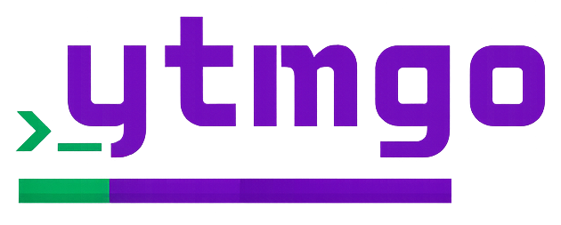
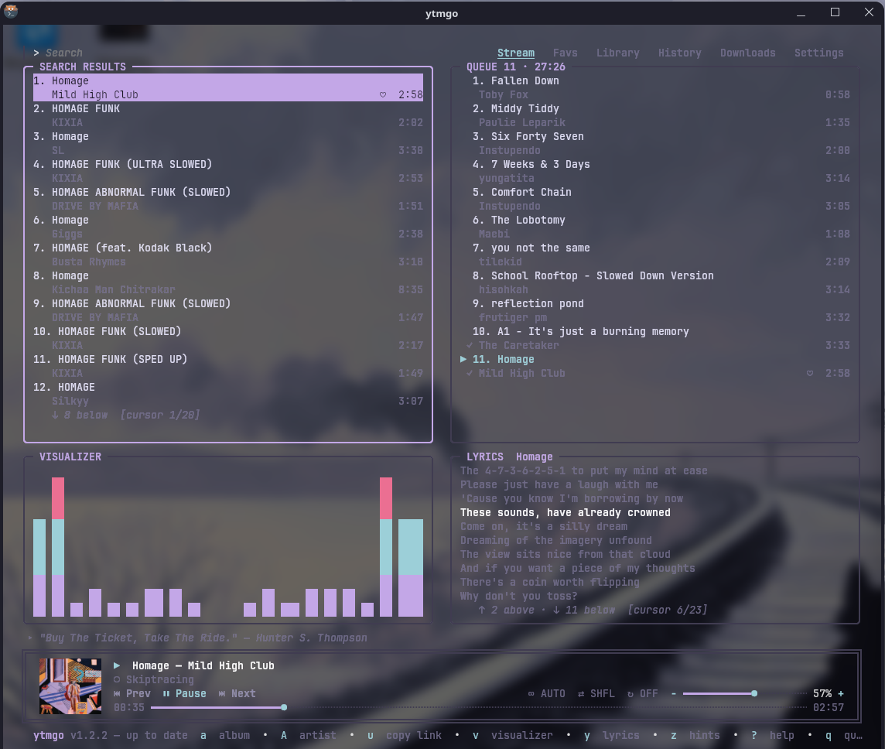

<p align="center">
  
</p>

# ytmgo — YT Music from Terminal

A terminal-based YouTube Music client written in Go. Search music, download audio, manage a play queue, bookmark favorites, and play music — all from the keyboard, inside your terminal.


---

## Install

### One-liner (Linux / macOS)

```bash
curl -fsSL https://anas1412.github.io/ytmgo/install.sh | bash
```

It detects your system automatically:
- **Arch Linux** — installs via `paru` or `yay` from the AUR (falls back to binary)
- **Other Linux / macOS** — downloads the static binary and installs deps

> Override the install dir: `YTMGO_INSTALL_DIR=/opt/bin curl ... | bash`

### AUR (Arch Linux)

The one-liner above handles this, but you can also install directly:

```bash
yay -S ytmgo
# or
paru -S ytmgo
```

### Build from source

```bash
go build -o ytmgo .
./ytmgo
```

---

## Uninstall

```bash
curl -fsSL https://anas1412.github.io/ytmgo/uninstall.sh | bash
```

Prompts you with three confirmations:

1. **Remove binary** — deletes `~/.local/bin/ytmgo` (or `/usr/local/bin/ytmgo`)
2. **Remove user data** — deletes `~/.config/ytmgo/` (settings, favorites, play history, queue)
3. **Remove downloads** — deletes `~/.local/share/ytmgo/downloads/` (all your downloaded files)

### Flags

| Flag | Behavior |
|------|----------|
| `-y` / `--yes` | Skip all prompts, remove **everything** |
| `--keep-downloads` | Keep your downloaded audio files |
| `--keep-user-data` | Keep your config database (settings, favorites, history) |

```bash
# Silent full removal
curl -fsSL https://anas1412.github.io/ytmgo/uninstall.sh | bash -s -- -y

# Remove binary + config, keep your music files
curl -fsSL https://anas1412.github.io/ytmgo/uninstall.sh | bash -s -- -y --keep-downloads

# Remove binary + files, keep your favorites and settings
curl -fsSL https://anas1412.github.io/ytmgo/uninstall.sh | bash -s -- -y --keep-user-data
```

System dependencies (mpv, yt-dlp, ffmpeg) are **not** touched — they may be used by other applications.

---

## Features

- **Native YouTube Music search** — Talks to YT Music's own API directly (no key, no login, no third-party proxy). Results carry exact video IDs, so playback starts on the right recording every time.
- **Autoplay radio** — When the queue runs dry, ytmgo queues what YouTube Music itself would play next, seeded from your listening history.
- **Download in one key** — Press `x` on any track and it downloads. Queue-friendly, one at a time, with progress feedback.
- **Favorites, history, library** — `f` to bookmark, a listening-history page, and a filterable page for everything on disk.
- **Full mouse support** — Click tabs, click panels, click the progress bar to seek. Most terminal apps can't do this.
- **Media keys / MPRIS** — Play, pause, and skip from your keyboard's media keys, playerctl, or desktop widgets (Linux).
- **Discord Rich Presence** — Show what you're listening to — track, artist, play status — live on your Discord profile.
- **Static binary, no bloat** — Pure Go, no Electron, no browser engine. Starts instantly, sips RAM, gets out of your way.

---

## Demo



---

## Prerequisites

- **Go** 1.22+
- **mpv** — audio playback backend
- **yt-dlp** — YouTube / YouTube Music streaming URL resolution and downloads
- **ffmpeg** — audio extraction for downloads (yt-dlp dependency)

### Install system dependencies

These are required for playback and downloads:

```bash
# Debian / Ubuntu
sudo apt install mpv yt-dlp ffmpeg

# macOS
brew install mpv yt-dlp ffmpeg

# Arch Linux
sudo pacman -S mpv yt-dlp ffmpeg
```

> Search and recommendations use YouTube Music's API directly. mpv plays the resulting watch URLs (resolving streams through its yt-dlp hook), and yt-dlp downloads tracks for offline use. ffmpeg handles audio extraction and cover-art embedding.

---

## Build & Run

```bash
# Clone or navigate to the project
cd ytmgo

# Build
go build -o ytmgo .

# Run
./ytmgo
```

---

## Usage

| Step | Action |
|------|--------|
| 1 | Press `Tab` to focus the search input |
| 2 | Type a query and press `Enter` |
| 3 | Browse results in the left panel (`↑↓` / `jk`) |
| 4 | Press `Enter` on a result: adds to queue, plays when idle (downloads too in Hybrid/Offline mode) |
| 5 | `Tab` to the queue panel, select a track, press `Enter` to play |
| 6 | Control playback with keys (see below) |

Tab cycles focus through: search input → result list → queue panel → search input — and the focused panel's border glows violet.

**Mouse support** — Click header tabs to switch pages, click list items to select, double-click to activate, click the progress bar to seek, and click the controls row to play/pause, adjust volume, or toggle shuffle/repeat.

**Media keys** — On Linux, ytmgo registers as an MPRIS player, so keyboard media keys, `playerctl`, and desktop media widgets control it directly.

### Keybindings

| Key | Action |
|-----|--------|
| `Tab` | Cycle focus: search → results → queue → search |
| `↑↓` / `jk` | Navigate lists |
| `g` / `G` | Jump to top / bottom of a list |
| `Enter` | Search: add to queue / Queue: play track |
| `Space` | Play / Pause |
| `n` / `→` | Next track |
| `p` / `←` | Previous track (restarts after 3s) |
| `h` / `Ctrl+B` | Seek backward 5s |
| `l` / `Ctrl+F` | Seek forward 5s |
| `+` / `=` | Volume up |
| `-` / `_` | Volume down |
| `d` / `Delete` | Remove from queue (Library: delete file) |
| `D` | Clear entire queue |
| `C` | Clear play history (History page) |
| `f` | Toggle favorite on selected track |
| `s` | Toggle shuffle |
| `r` | Cycle repeat: OFF → ONE → ALL |
| `x` | Download selected track |
| `R` | Refresh recommendations |
| `U` | Check for updates / confirm install |
| `1` … `5` | Switch page: Stream / Favorites / Library / History / Settings |
| `Ctrl+↑` / `Ctrl+↓` | Move item up/down in queue |
| `o` | Open download directory |
| `?` | Open the Settings page (includes all shortcuts) |
| `esc` | Cancel / back |
| `q` / `Ctrl+C` | Quit |

---

## Built With

- [Bubble Tea](https://github.com/charmbracelet/bubbletea) — TUI framework
- [Bubbles](https://github.com/charmbracelet/bubbles) — TUI components
- [Lipgloss](https://github.com/charmbracelet/lipgloss) — Terminal styling
- [mpv](https://mpv.io/) — Media player backend (one persistent instance, JSON IPC)
- [yt-dlp](https://github.com/yt-dlp/yt-dlp) — Downloads and stream resolution
- [ffmpeg](https://ffmpeg.org/) — Audio extraction and cover-art embedding
- YouTube Music InnerTube API — Track search, radio, and recommendations (keyless)
- [godbus](https://github.com/godbus/dbus) — MPRIS media-key integration
- [modernc.org/sqlite](https://modernc.org/sqlite) — Embedded SQLite (no CGO)

---

## License

MIT
